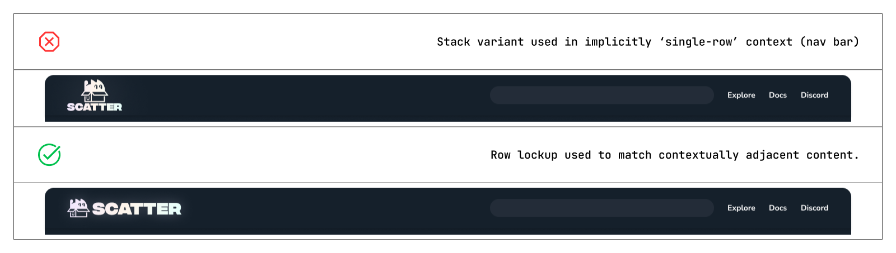

# Scatter Media Kit

The Scatter brand embraces community creativity and is available for use in press and creative media. Whilst Scatter encourages and welcomes creative usage and interpretation of it's brand identity, please observe the guidelines below when working with our assets.

We look forward to seeing what you create with us.

## Brand Anatomy

### Catbox (Scatter brand mark)

The Catbox logo serves as Scatter's primary brand mark and we encourage liberal usage of the Catbox in any collaborative media, or creative works by Scatter affiliated creators. We encourage freedom to creatively remix the Catbox logo across various medias - animation, illustration, 3d rendering etc. - as long as the fundamental identity of the symbol and it's relationship with Scatter remains clear in the resultant interpretation.

The Catbox logo can be used independently in any context where the relationship to Scatter and/or wherever the scatter.art url has already been clearly established.

#### Catbox sizes

Whilst the Catbox symbol is designed for flexible usage at a number of sizes, it works best at larger sizes to help support the character-driven nature of the design.

The Catbox logo should very rarely be used at resolutions lower than 40px, and _never_ presented at lower than 24px.

### Scatter full brand

Scatter's full brand lockup should be preferred in any context where Scatter and/or the scatter.art url are not already explicitly stated or known.

#### Lockups

Two lockups are available for presenting the full Scatter branding: Stack and Row.

##### Stack

The stack variant should be considered the preferred presentation wherever possible, however it is only appropriate for use in contexts where adequate vertical space is available. The stack lockup should not be used where it is presented inline with associated content that is shown in a single row - ie, the stack logo should not be used alongside a non-stack logo lockup for a partner brand, or in a site/webapp nav bar element where other branding, nav items etc appear in a single line.

##### Row

The row variant should be utilised wherever the preferred stack lockup isn't suitable. This lockup should always be used in common single-row contexts such as site/webapp nav bars, or when presented alongside a partner brand in a similarly single-row format.

##### Usage

## Brand Colors

The Scatter brand identity aims to present itself in a way that allows for the celebration of it's creative partners, users, and community to take center stage, therefore the Scatter design system color palette remains intentionally simplified. Furthermore, we encourage great creative freedom when working with Scatter brand assets and choose not to provide strict color rules but ask arther that you observe the following guidelines and recommendations.

### Basis colorways

|                      | Foreground | Background | Usage notes                                |
| -------------------- | ---------- | ---------- | ------------------------------------------ |
| Accented (on-dark)   | #F1E7FF    | #272727    | Preferred colorway in most contexts        |
| Accented (on-bright) | #41384D    | #fefefe    | Preferred fallback for light-mode contexts |

NOTE: Whenever the Scatter brand should appear on pure black or pure white backgrounds, pure monochrome presentation is recommended. If either of the foreground options above are used however, they should _always_ appear on their associated background swatch.

### Special colorways

Wherever emphasised/'hero' presentation of the Scatter brand is appropriate, utilisation of the Scatter Shimmer and/or the Scatter Glow is recommended.

#### Scatter Shimmer

|                  | Start   | Mid     | End     |
| ---------------- | ------- | ------- | ------- |
| Linear Gradient: | #F1E7FF | #FFF6EC | #E7FFE9 |

NOTE: The Scatter Shimmer gradient is designed to imitate iredescence effects, as such the specific saturations of each 3 gradient stops are very precise and should not be modified if this effect is desired. The Scatter Shimmer can be animated, but should generally only cycle through the 3 above swatches.

#### Scatter Glow

Adding a characteristic 'glow' to Scatter brand elements is encouraged, however it should match the samples provided throughout this guide. Generally a drop shadow or box shadow effect should be used, with x and y offset values of 0 (to create a glow rather than a directional shadow effect), however exact opacity and blur values will change contextually depending on the size/resolution of the presentation. Please adjust blur and transparency accordingly to appropximate the samples in this guide. Remember, the Scatter Glow should merely 'glow', and not read as a shadow.

### Remix Colors

When presented in third-party contexts, the Scatter brand can freely be presented using the third-party brand colors, as long as an approximate minimum contrast ratio of 4.5:1 is preserved.

### Usage

